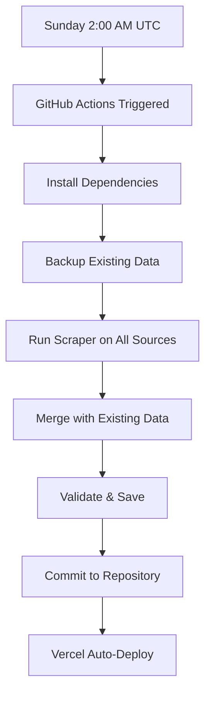

# ExamFit Automated Data Scraping System

This system automatically scrapes exam questions from free educational websites and updates your data.json file weekly.

## 🚀 Features

- **Weekly Automation**: Runs every Sunday at 2:00 AM UTC via GitHub Actions
- **Multiple Sources**: Scrapes from Jagran Josh, GKToday, AffairsCloud
- **Smart Merging**: Avoids duplicates, preserves existing data
- **Free OCR Support**: Processes PDFs using Tesseract
- **Backup System**: Creates backups before updates
- **Vercel Integration**: Auto-deploys to your live site

## 📁 Files Overview

```
scripts/
├── data_scraper.py      # Main scraping script
├── data_merger.py       # Handles data merging
├── config.json         # Source URLs and settings
├── requirements.txt    # Python dependencies
└── README.md          # This file

.github/workflows/
└── update-data.yml     # GitHub Actions automation
```

## 🛠️ Setup Instructions

### 1. Enable GitHub Actions

1. Go to your GitHub repository
2. Click on "Actions" tab
3. Enable workflows if not already enabled
4. The workflow will run automatically every Sunday

### 2. Manual Testing (Optional)

To test the system locally:

```bash
# Navigate to scripts directory
cd scripts

# Install dependencies
pip install -r requirements.txt

# Install system dependencies (Ubuntu/Debian)
sudo apt-get install tesseract-ocr tesseract-ocr-eng poppler-utils

# Run the scraper
python data_scraper.py
```

### 3. Configure Sources

Edit `config.json` to add/remove sources:

```json
{
  "sources": [
    {
      "name": "jagran_josh",
      "description": "Free question bank from Jagran Josh",
      "urls": [
        "https://www.jagranjosh.com/general-knowledge/...",
        "..."
      ],
      "active": true
    }
  ]
}
```

## 📊 How It Works

### Weekly Automation Flow



### Data Structure

Questions are organized as:
```
Exam (UPSC/SSC) 
  → Subject (General Studies/Current Affairs)
    → Question Paper (Auto-Updated January 2025)
      → Questions (with metadata)
```

### Smart Merging

- **Duplicate Detection**: Uses question text + first option hash
- **Preserves Existing**: Keeps manually added questions
- **Adds New**: Only adds unique questions from sources
- **Backup Safety**: Creates backups before any changes

## 🎯 Supported Sources

### Currently Active

1. **Jagran Josh** - General Knowledge & Current Affairs
2. **GKToday** - MCQs and Practice Questions  
3. **AffairsCloud** - Monthly Current Affairs

### Easy to Add More

To add new sources:

1. Add URL to `config.json`
2. Create scraper method in `data_scraper.py`:
   ```python
   def scrape_new_source(self, url):
       # Your scraping logic here
       return questions_list
   ```

## 📈 Monitoring & Logs

### GitHub Actions Logs

- View detailed logs in GitHub Actions tab
- Success/failure notifications
- Data statistics in summary

### Manual Monitoring

Check the automation status:
- **Last Update**: Check `lastUpdated` field in data.json
- **Question Count**: Monitor total questions growth
- **Sources**: Track which sources contributed data

## 🔧 Customization

### Update Frequency

Change in `.github/workflows/update-data.yml`:
```yaml
schedule:
  - cron: '0 2 * * 0'  # Every Sunday 2:00 AM UTC
  # - cron: '0 2 * * *'  # Daily 2:00 AM UTC
  # - cron: '0 2 1 * *'  # Monthly 1st day 2:00 AM UTC
```

### Exam Mappings

Configure how questions are categorized in `config.json`:
```json
"exam_mappings": {
  "upsc": {
    "examId": "upsc",
    "examName": "Union Public Service Commission(CSE)",
    "subjects": {
      "general-studies": "General Studies",
      "current-affairs": "Current Affairs"
    }
  }
}
```

### Scraping Settings

Adjust delays and limits:
```json
"scraping_settings": {
  "delay_between_requests": 2,
  "timeout": 30,
  "max_questions_per_source": 100,
  "retry_attempts": 3
}
```

## 🛡️ Legal & Ethical

- **Respects robots.txt**: Follows website guidelines
- **Rate Limiting**: Waits between requests (2 seconds default)
- **Attribution**: Tracks source for each question
- **Fair Use**: Only scrapes publicly available content

## ❗ Troubleshooting

### Common Issues

**1. Workflow Not Running**
- Check if GitHub Actions are enabled
- Verify the cron syntax in workflow file

**2. No Questions Scraped**
- Website structure may have changed
- Check logs for specific errors
- Test individual source URLs

**3. Invalid JSON Error**
- Backup files will be restored automatically
- Check for special characters in scraped text

**4. Import Errors**
- Ensure all Python dependencies are installed
- Check requirements.txt is up to date

### Manual Intervention

If automation fails:
```bash
# Run manually with debug info
cd scripts
python -c "
import logging
logging.basicConfig(level=logging.DEBUG)
from data_scraper import ExamDataScraper
scraper = ExamDataScraper()
scraper.run_scraping()
scraper.save_data()
"
```

## 📝 Data Quality

### Validation

- **JSON Structure**: Validates before saving
- **Required Fields**: Ensures all questions have required data
- **Duplicate Detection**: Prevents question duplication
- **Backup Recovery**: Restores from backup if validation fails

### Improvement Tips

1. **Review New Questions**: Periodically check auto-generated questions
2. **Update Sources**: Add new reliable educational websites
3. **Correct Answers**: Manually verify and update correct answers
4. **Question Quality**: Remove low-quality questions via dashboard

## 🚀 Advanced Features

### OCR Processing

For PDF question papers:
```python
# Add to requirements.txt
pytesseract>=0.3.10
pdf2image>=1.16.0

# OCR usage in scraper
from pdf2image import convert_from_path
import pytesseract

def process_pdf(pdf_path):
    images = convert_from_path(pdf_path)
    text = ""
    for image in images:
        text += pytesseract.image_to_string(image)
    return text
```

### API Integration

For educational platform APIs:
```python
def scrape_api_source(self, api_url, api_key):
    headers = {'Authorization': f'Bearer {api_key}'}
    response = self.session.get(api_url, headers=headers)
    return self.parse_api_response(response.json())
```

## 📞 Support

- **Issues**: Report in GitHub Issues
- **Updates**: Check for scraper updates regularly
- **Sources**: Suggest new sources in Issues

---

**🎯 Result**: Fresh, real exam questions updated weekly, automatically deployed to your live site!
